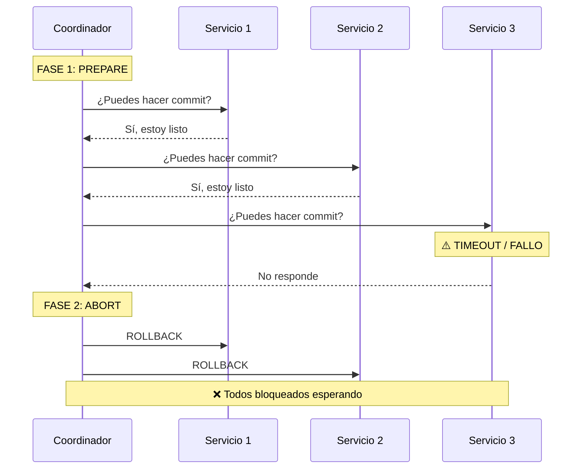
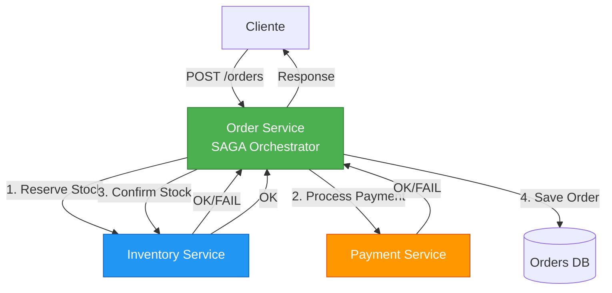
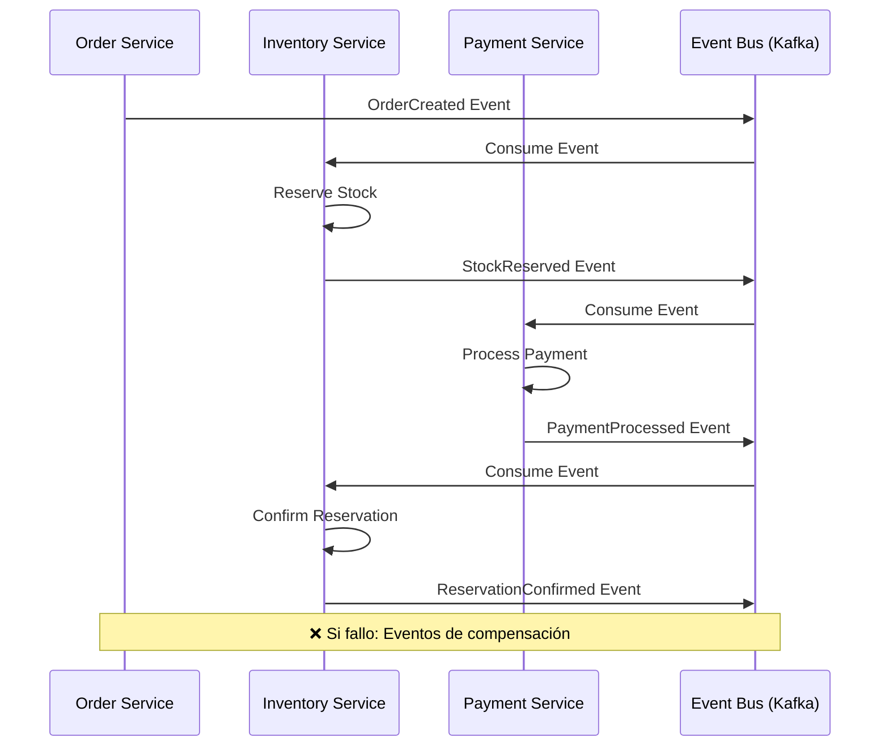
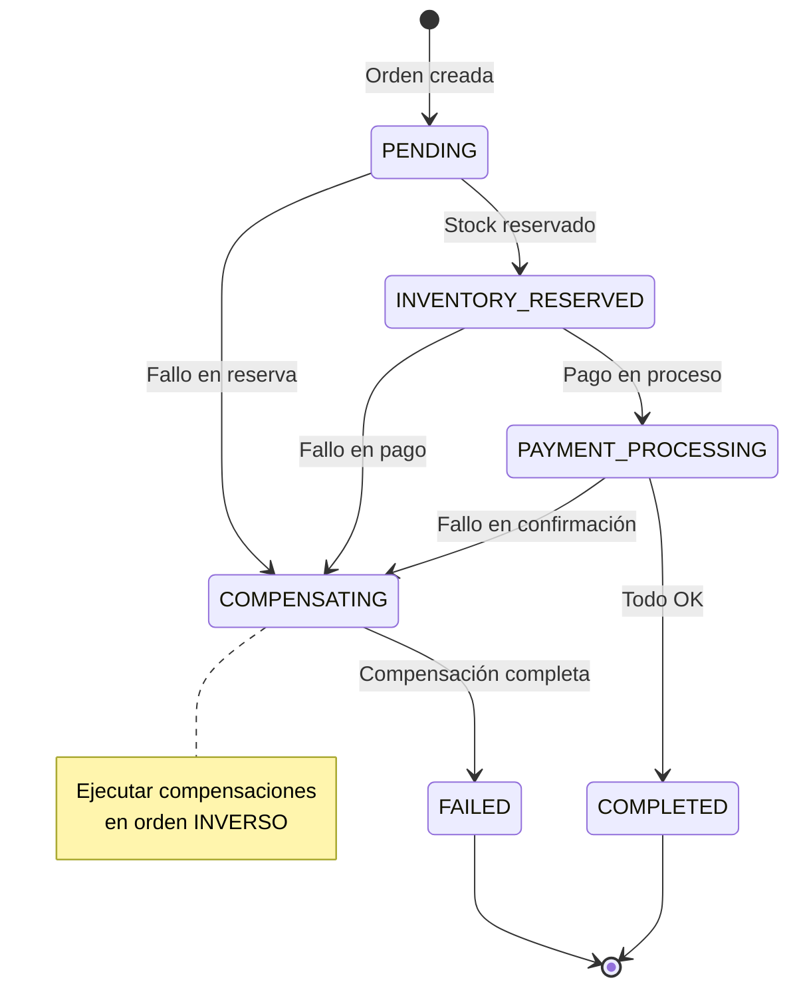
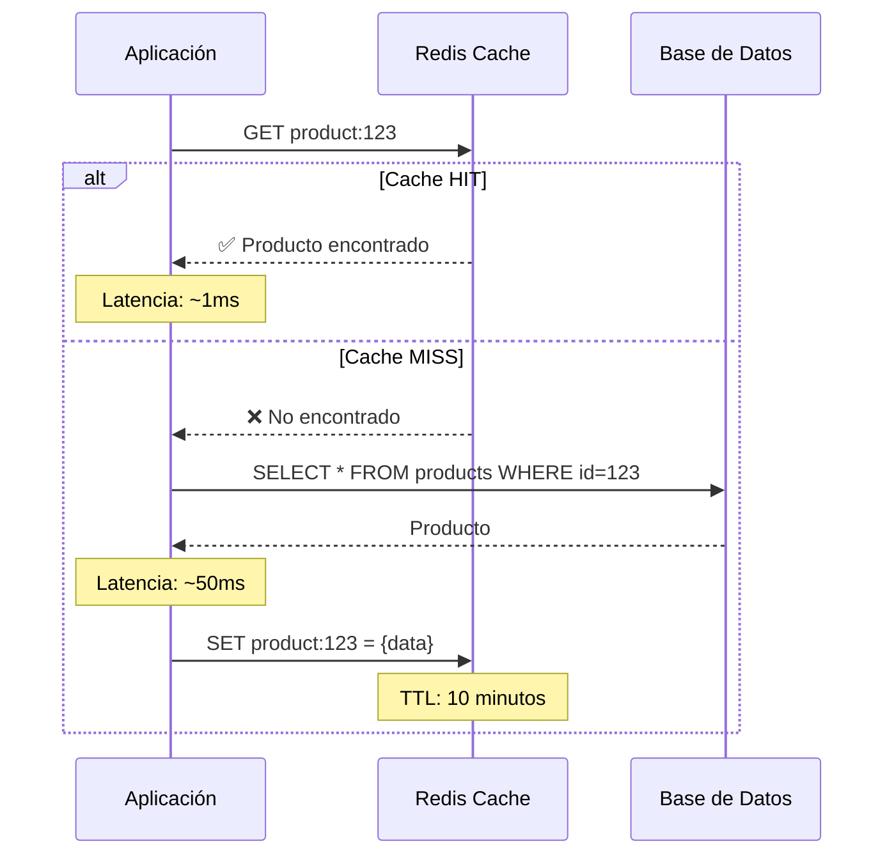
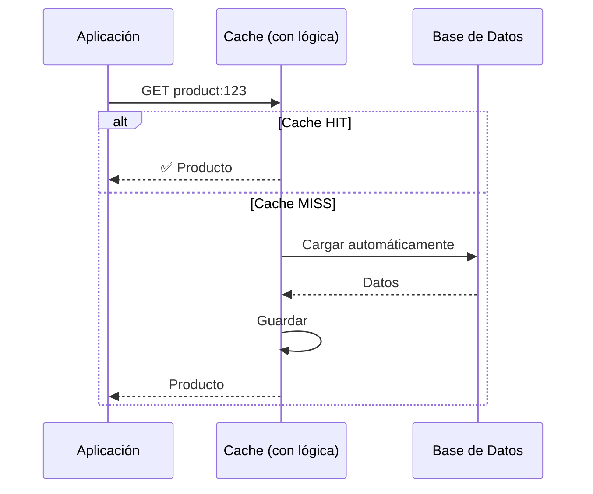
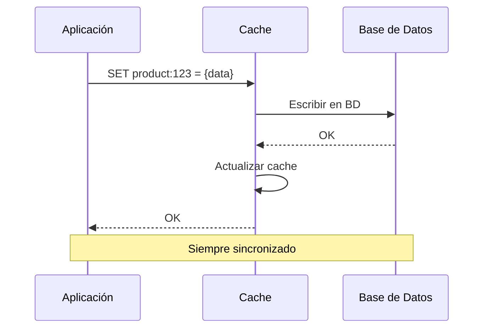
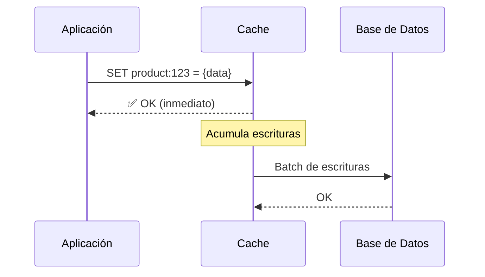
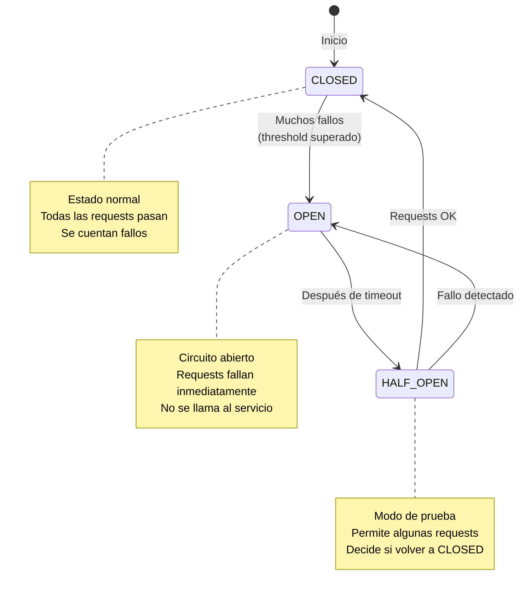

# 📚 TEORÍA - Capítulo 10: Patrones Avanzados para Microservicios

## Sistema E-Commerce con Patrón SAGA y Redis Cache

---

## 📋 Tabla de Contenidos

1. [Introducción](#1-introducción)
2. [El Problema de las Transacciones Distribuidas](#2-el-problema-de-las-transacciones-distribuidas)
3. [Patrón SAGA en Profundidad](#3-patrón-saga-en-profundidad)
4. [Redis Cache y Patrones de Caché](#4-redis-cache-y-patrones-de-caché)
5. [Circuit Breaker y Fault Tolerance](#5-circuit-breaker-y-fault-tolerance)
6. [Consistencia Eventual](#6-consistencia-eventual)
7. [Comparaciones y Trade-offs](#7-comparaciones-y-trade-offs)
8. [Casos de Uso Reales](#8-casos-de-uso-reales)
9. [Mejores Prácticas](#9-mejores-prácticas)
10. [Antipatrones Comunes](#10-antipatrones-comunes)
11. [Referencias y Recursos](#11-referencias-y-recursos)

---

## 1. Introducción

### 🎯 ¿Por qué este capítulo es crucial?

En arquitecturas de microservicios, dos desafíos fundamentales emergen constantemente:

1. **¿Cómo coordinar operaciones que involucran múltiples servicios?**
2. **¿Cómo optimizar el rendimiento sin sacrificar la consistencia?**

Este capítulo aborda ambas preguntas implementando:
- **Patrón SAGA**: Para transacciones distribuidas con compensaciones
- **Redis Cache**: Para optimización de consultas frecuentes

### 🎭 Analogía del Director de Orquesta

Imagina una orquesta sinfónica tocando una pieza compleja:

- **Sin coordinación**: Cada músico toca a su ritmo → Caos total
- **Con director (SAGA)**: El director coordina, y si un violinista se equivoca, el director puede indicar "volvamos al compás anterior" (compensación)
- **Con memoria (Cache)**: Los músicos tienen las partituras memorizadas para las piezas que tocan frecuentemente → No necesitan mirar constantemente el atril

---

## 2. El Problema de las Transacciones Distribuidas

### 2.1 Transacciones ACID vs BASE

#### ACID (Bases de Datos Monolíticas)

En una aplicación monolítica con una sola base de datos, tenemos:

```
┌─────────────────────────────────┐
│     APLICACIÓN MONOLÍTICA       │
│                                 │
│  BEGIN TRANSACTION;             │
│    UPDATE accounts              │
│      SET balance = balance - 100│
│      WHERE id = 1;              │
│                                 │
│    UPDATE accounts              │
│      SET balance = balance + 100│
│      WHERE id = 2;              │
│  COMMIT;                        │
│                                 │
│  ✅ Todo o nada (atomicidad)   │
└─────────────────────────────────┘
          │
          ▼
    ┌─────────┐
    │   BD    │
    └─────────┘
```

**Garantías ACID:**
- **A**tomicity: Todo o nada
- **C**onsistency: Datos siempre consistentes
- **I**solation: Transacciones aisladas
- **D**urability: Cambios permanentes

#### BASE (Microservicios Distribuidos)

Con microservicios, cada servicio tiene su propia base de datos:

```
┌───────────────┐       ┌───────────────┐       ┌───────────────┐
│ Order Service │       │Inventory Svc  │       │ Payment Svc   │
│               │──────▶│               │──────▶│               │
│ BD Orders     │       │ BD Inventory  │       │ BD Payments   │
└───────────────┘       └───────────────┘       └───────────────┘

❌ NO podemos hacer una transacción ACID entre 3 BDs diferentes
```

**Propiedades BASE:**
- **B**asically **A**vailable: Sistema siempre disponible
- **S**oft state: El estado puede cambiar sin input (eventual)
- **E**ventual consistency: Consistencia eventual, no inmediata

### 2.2 El Teorema CAP

**Teorema CAP** (Eric Brewer, 2000): En un sistema distribuido, solo puedes garantizar 2 de 3:

```
         Consistencia (C)
              ▲
             ╱ ╲
            ╱   ╲
           ╱     ╲
          ╱  ❓   ╲
         ╱         ╲
        ╱___________╲
    Disponibilidad  Tolerancia a
         (A)        Particiones (P)

Microservicios → Elegimos AP (Disponibilidad + Particiones)
Perdemos C (Consistencia inmediata) → Usamos consistencia eventual
```

**Analogía**: Es como un sistema de mensajería:
- **CA**: Todos ven el mismo mensaje al mismo tiempo, pero si la red falla, el sistema se cae
- **AP**: El sistema siempre funciona, pero puede haber retraso en que todos vean el mensaje
- **CP**: Todos ven lo mismo o nadie ve nada (no útil para alta disponibilidad)

### 2.3 El Problema de 2PC (Two-Phase Commit)

**2PC** es la solución "clásica" para transacciones distribuidas:



**Problemas de 2PC:**
1. **Bloqueo**: Todos esperan al más lento
2. **Punto único de fallo**: Si el coordinador falla, todos se bloquean
3. **No escalable**: Crece O(n²) con el número de servicios
4. **Latencia alta**: Dos viajes de red completos

**Analogía**: Es como un grupo de amigos decidiendo dónde ir a comer:
- **2PC**: "Nadie pide hasta que TODOS hayamos decidido" → Si uno está indeciso, NADIE come
- **SAGA**: "Vamos pidiendo, y si alguien cambia de opinión, cancelamos su pedido" → Progreso constante

---

## 3. Patrón SAGA en Profundidad

### 3.1 ¿Qué es una SAGA?

**Definición**: Una SAGA es una secuencia de transacciones locales donde cada transacción actualiza datos en un solo servicio. Si una transacción falla, la SAGA ejecuta transacciones compensatorias para deshacer los cambios.

**Paper original**: "Sagas" por Hector Garcia-Molina & Kenneth Salem (1987)

### 3.2 Tipos de SAGA

#### 3.2.1 SAGA con Orquestación (Orchestration)

**Nuestro ejercicio usa este patrón**



**Características:**
- ✅ Un orquestador central coordina todo
- ✅ Lógica de compensación centralizada
- ✅ Fácil de entender y mantener
- ✅ Buen para flujos complejos con muchas reglas de negocio
- ❌ Puede convertirse en un "god object"
- ❌ Punto único de fallo (mitigable con HA)

**Código del Orquestador (simplificado):**

```java
@ApplicationScoped
public class OrderSagaOrchestrator {
    
    public SagaResult executeSaga(Order order, String paymentMethod) {
        List<CompletedStep> steps = new ArrayList<>();
        
        try {
            // PASO 1: Reservar inventario
            for (OrderItem item : order.items) {
                inventoryClient.reserveStock(item);
                steps.add(new CompletedStep("INVENTORY", item));
            }
            
            // PASO 2: Procesar pago
            paymentClient.processPayment(order);
            steps.add(new CompletedStep("PAYMENT", order.id));
            
            // PASO 3: Confirmar inventario
            for (OrderItem item : order.items) {
                inventoryClient.confirmReservation(item);
            }
            
            // PASO 4: Marcar orden como completada
            order.status = COMPLETED;
            
            return SagaResult.success();
            
        } catch (Exception e) {
            // ⚠️ COMPENSACIÓN: Deshacer en orden INVERSO
            compensate(steps);
            return SagaResult.failure(e.getMessage());
        }
    }
    
    private void compensate(List<CompletedStep> steps) {
        // Iterar en REVERSA (LIFO)
        for (int i = steps.size() - 1; i >= 0; i--) {
            CompletedStep step = steps.get(i);
            
            switch (step.type) {
                case "PAYMENT":
                    paymentClient.refund(step.orderId);
                    break;
                case "INVENTORY":
                    inventoryClient.cancelReservation(step.item);
                    break;
            }
        }
    }
}
```

**Analogía**: Un jefe de proyecto (orquestador) asigna tareas:
- "Juan, haz X" → Juan lo hace → Jefe: "OK, María haz Y"
- Si María falla → Jefe: "Juan, deshace X"

#### 3.2.2 SAGA con Coreografía (Choreography)



**Características:**
- ✅ Sin punto único de fallo
- ✅ Muy desacoplado
- ✅ Cada servicio es autónomo
- ❌ Difícil de entender el flujo completo
- ❌ Difícil de debuggear
- ❌ Lógica de negocio distribuida

**Analogía**: Un equipo de fútbol sin entrenador:
- Cada jugador reacciona a lo que ve
- Si el portero atrapa el balón → los defensas suben
- Si fallan → cada uno compensa su posición
- ❌ Difícil coordinar jugadas complejas

### 3.3 Compensaciones: La Clave de SAGA

#### 3.3.1 Tipos de Operaciones

**1. Operaciones Compensables**
- Tienen una operación inversa
- Ejemplo: `reserveStock()` ↔ `cancelReservation()`

**2. Operaciones Pivot**
- Punto de no retorno
- Ejemplo: Enviar email de confirmación

**3. Operaciones Retriables**
- Pueden fallar temporalmente pero se pueden reintentar
- Ejemplo: Llamadas HTTP con timeout

#### 3.3.2 Diseño de Compensaciones

**Regla de Oro**: Las compensaciones deben ser **idempotentes** y **retriables**

```java
// ❌ MAL: No es idempotente
public void cancelReservation(String orderId) {
    int reserved = getReservedStock(orderId);
    stock += reserved;  // Si se llama 2 veces, suma 2 veces
}

// ✅ BIEN: Idempotente
public void cancelReservation(String orderId) {
    Reservation res = reservations.get(orderId);
    if (res != null && res.status == RESERVED) {
        stock += res.quantity;
        res.status = CANCELLED;
    }
    // Si se llama 2 veces, solo actúa la primera vez
}
```

#### 3.3.3 Compensaciones en Nuestro Ejercicio

```java
private void compensate(Order order, List<SagaStep> completedSteps) {
    LOG.warn("🔄 Iniciando compensaciones para orden: " + order.id);
    
    // ⚠️ IMPORTANTE: Recorrer en ORDEN INVERSO (LIFO)
    for (int i = completedSteps.size() - 1; i >= 0; i--) {
        SagaStep step = completedSteps.get(i);
        
        try {
            switch (step.stepType) {
                case "PAYMENT":
                    // Reembolsar dinero
                    paymentClient.refundPayment(order.id);
                    break;
                    
                case "INVENTORY_RESERVE":
                    // Liberar stock reservado
                    inventoryClient.cancelReservation(order.id, step.productCode);
                    break;
            }
        } catch (Exception e) {
            // ⚠️ En producción: enviar a cola de retry
            LOG.error("Error al compensar: " + step.stepType, e);
        }
    }
}
```

**¿Por qué en orden inverso (LIFO)?**

Imagina que estás construyendo una torre de naipes:
1. Pones carta A
2. Pones carta B encima de A
3. Pones carta C encima de B

Si algo falla, debes quitar:
1. Primero C (última puesta)
2. Luego B
3. Finalmente A

Si intentas quitar A primero → ¡La torre se cae!

### 3.4 Estados de una SAGA



### 3.5 Ventajas y Desventajas de SAGA

#### ✅ Ventajas

1. **Escalabilidad**: Cada servicio puede escalar independientemente
2. **No hay bloqueos**: Transacciones locales, no bloqueantes
3. **Resiliente**: Si un servicio falla, los demás continúan
4. **Flexibilidad**: Fácil agregar nuevos pasos

#### ❌ Desventajas

1. **Complejidad**: Más código que 2PC
2. **Inconsistencia temporal**: Los datos pueden estar inconsistentes durante la SAGA
3. **Compensaciones complejas**: No todas las operaciones son compensables
4. **Testing difícil**: Muchos escenarios de fallo posibles

---

## 4. Redis Cache y Patrones de Caché

### 4.1 ¿Por qué Redis?

**Redis** (REmote DIctionary Server) es una base de datos en memoria ultra-rápida.

**Comparación de latencias:**

```
┌─────────────────────────────────────────────────────┐
│ Operación              │ Latencia     │ Comparación│
├─────────────────────────────────────────────────────┤
│ L1 Cache               │ 0.5 ns       │ 1 segundo  │
│ Redis (local)          │ 1-10 ms      │ 1 semana   │
│ PostgreSQL (local)     │ 50-100 ms    │ 3 meses    │
│ HTTP API               │ 100-500 ms   │ 1 año      │
└─────────────────────────────────────────────────────┘

Redis es ~10-100x más rápido que una BD tradicional
```

**Analogía**: Redis es como tu memoria RAM vs el disco duro:
- **RAM (Redis)**: Acceso instantáneo, pero volátil y limitado
- **Disco (PostgreSQL)**: Más lento, pero persistente y espacioso

### 4.2 Patrones de Caché

#### 4.2.1 Cache-Aside (Lazy Loading) - **NUESTRO PATRÓN**



**Implementación en nuestro ejercicio:**

```java
private ProductInfoDTO getProductWithCache(String productCode) {
    String cacheKey = PRODUCT_CACHE_PREFIX + productCode;
    
    // 1. Intentar obtener del cache (RÁPIDO ~1ms)
    ProductInfoDTO cached = productCache.get(cacheKey);
    if (cached != null) {
        LOG.debug("🎯 Cache HIT para producto: " + productCode);
        return cached;
    }
    
    // 2. Cache MISS - obtener del servicio (LENTO ~50ms)
    LOG.debug("❌ Cache MISS - consultando servicio");
    ProductInfoDTO product = inventoryClient.getProduct(productCode);
    
    // 3. Guardar en cache con TTL de 10 minutos
    SetArgs setArgs = new SetArgs().ex(Duration.ofMinutes(10));
    productCache.set(cacheKey, product, setArgs);
    
    return product;
}
```

**Ventajas:**
- ✅ Simple de implementar
- ✅ El cache solo contiene datos que realmente se usan
- ✅ La aplicación controla qué cachear

**Desventajas:**
- ❌ Primera consulta siempre es lenta (cache miss)
- ❌ Puede haber "thundering herd" (muchas consultas simultáneas)

#### 4.2.2 Read-Through



**Ventajas:**
- ✅ Lógica de carga centralizada
- ✅ Aplicación más simple

**Desventajas:**
- ❌ Requiere cache "inteligente"
- ❌ Menos flexible

#### 4.2.3 Write-Through



**Ventajas:**
- ✅ Datos siempre frescos
- ✅ Consistencia fuerte

**Desventajas:**
- ❌ Escrituras lentas (doble escritura)
- ❌ Puede cachear datos que nunca se leen

#### 4.2.4 Write-Behind (Write-Back)



**Ventajas:**
- ✅ Escrituras ultra-rápidas
- ✅ Reduce carga en BD (batch)

**Desventajas:**
- ❌ Riesgo de pérdida de datos si cache falla
- ❌ Complejidad alta

### 4.3 TTL (Time To Live) y Eviction

**TTL**: Tiempo que un dato permanece en cache antes de expirar.

```java
// Configurar TTL en Redis
SetArgs args = new SetArgs()
    .ex(Duration.ofMinutes(10));  // Expira en 10 minutos

cache.set(key, value, args);
```

**Políticas de Eviction** (cuando el cache se llena):

| Política | Descripción | Uso |
|----------|-------------|-----|
| **LRU** (Least Recently Used) | Elimina lo menos usado recientemente | General purpose ✅ |
| **LFU** (Least Frequently Used) | Elimina lo menos frecuentemente usado | Datos con patrones de acceso claros |
| **FIFO** (First In First Out) | Elimina lo más antiguo | Datos temporales |
| **Random** | Elimina aleatoriamente | Testing, casos simples |

```
# Redis configuration
maxmemory 256mb
maxmemory-policy allkeys-lru  # Recomendado para cache general
```

### 4.4 Cache Invalidation: "El problema más difícil"

> "There are only two hard things in Computer Science: cache invalidation and naming things."  
> — Phil Karlton

#### Estrategias de Invalidación

**1. TTL-based (Nuestro enfoque)**
```java
// Cache expira automáticamente después de 10 minutos
SetArgs args = new SetArgs().ex(Duration.ofMinutes(10));
```

**Pros:**
- ✅ Simple
- ✅ Previene datos obsoletos extremadamente viejos

**Cons:**
- ❌ Puede servir datos obsoletos durante el TTL
- ❌ No es óptimo para datos críticos

**2. Event-based Invalidation**
```java
// Cuando se actualiza un producto en Inventory Service
@Transactional
public void updateProduct(Product product) {
    productRepository.persist(product);
    
    // Publicar evento
    eventBus.publish(new ProductUpdatedEvent(product.code));
}

// Order Service escucha y invalida
@Incoming("product-updates")
public void onProductUpdated(ProductUpdatedEvent event) {
    orderService.invalidateProductCache(event.productCode);
}
```

**Pros:**
- ✅ Invalidación inmediata
- ✅ Consistencia más fuerte

**Cons:**
- ❌ Complejidad adicional (event bus)
- ❌ Posible pérdida de eventos

**3. Write-Through (sincronía forzada)**
```java
public void updateProduct(Product product) {
    // 1. Actualizar BD
    productRepository.persist(product);
    
    // 2. Actualizar cache inmediatamente
    cache.set(cacheKey, product);
}
```

**Pros:**
- ✅ Siempre consistente

**Cons:**
- ❌ Acoplamiento fuerte
- ❌ Más lento

### 4.5 Cache Stampede (Thundering Herd)

**Problema**: Cuando muchas solicitudes golpean un cache miss simultáneamente.

```
Cache expira a las 10:00:00

10:00:00.001 → Request 1: Cache MISS → Consulta BD
10:00:00.002 → Request 2: Cache MISS → Consulta BD
10:00:00.003 → Request 3: Cache MISS → Consulta BD
...
10:00:00.100 → Request 100: Cache MISS → Consulta BD

❌ 100 consultas a la BD simultáneas! (podría caer)
```

**Solución 1: Locking (Probabilistic Early Expiration)**

```java
public ProductInfoDTO getWithLock(String productCode) {
    String lockKey = "lock:" + productCode;
    
    // Intentar obtener lock
    boolean gotLock = redisClient.setnx(lockKey, "1", Duration.ofSeconds(5));
    
    if (gotLock) {
        try {
            // Solo este thread consulta la BD
            ProductInfoDTO product = inventoryClient.getProduct(productCode);
            cache.set(cacheKey, product);
            return product;
        } finally {
            redisClient.del(lockKey);
        }
    } else {
        // Otros threads esperan un poco y reintentan cache
        Thread.sleep(100);
        return cache.get(cacheKey);
    }
}
```

**Solución 2: Probabilistic Early Expiration**

```java
public ProductInfoDTO getWithProbabilisticRefresh(String productCode) {
    ProductInfoDTO cached = cache.get(cacheKey);
    
    if (cached != null) {
        long timeToExpire = cache.ttl(cacheKey);
        long ttl = Duration.ofMinutes(10).toSeconds();
        
        // Probabilidad = delta * beta * log(rand)
        double delta = System.currentTimeMillis() / 1000.0;
        double beta = 1.0;
        double probability = delta * beta * Math.log(Math.random());
        
        if (timeToExpire < probability) {
            // Refrescar proactivamente
            asyncRefresh(productCode);
        }
        
        return cached;
    }
    
    // Cache miss normal
    return loadAndCache(productCode);
}
```

### 4.6 Métricas de Cache

**Indicadores clave:**

```java
public class CacheMetrics {
    private AtomicLong hits = new AtomicLong(0);
    private AtomicLong misses = new AtomicLong(0);
    
    public double getHitRate() {
        long totalRequests = hits.get() + misses.get();
        if (totalRequests == 0) return 0.0;
        return (double) hits.get() / totalRequests;
    }
    
    public void recordHit() { hits.incrementAndGet(); }
    public void recordMiss() { misses.incrementAndGet(); }
}

// Monitorear
LOG.info("Cache Hit Rate: " + metrics.getHitRate() * 100 + "%");
```

**Hit Rate ideal:**
- ✅ > 80%: Excelente
- ⚠️ 50-80%: Aceptable
- ❌ < 50%: Revisar estrategia de cache

---

## 5. Circuit Breaker y Fault Tolerance

### 5.1 El Problema: Fallos en Cascada

```
User Request
    │
    ▼
Order Service (OK)
    │
    ▼
Inventory Service (LENTO - 30s timeout)
    │
    ▼
❌ Todos los threads del Order Service bloqueados esperando
❌ Order Service se cae por falta de recursos
❌ Otros servicios que dependen de Order Service también fallan
❌ EFECTO DOMINÓ
```

**Analogía**: Es como un fusible en tu casa:
- Si un electrodoméstico falla y consume mucha corriente
- El fusible "se abre" (circuit breaker)
- Protege el resto del sistema eléctrico

### 5.2 Estados del Circuit Breaker



### 5.3 Implementación con Quarkus

```java
@CircuitBreaker(
    requestVolumeThreshold = 4,        // Mínimo 4 requests para evaluar
    failureRatio = 0.5,                // 50% de fallos = abrir circuito
    delay = 5000,                      // Esperar 5s antes de HALF_OPEN
    successThreshold = 2               // 2 éxitos en HALF_OPEN = cerrar
)
@Timeout(value = 30, unit = ChronoUnit.SECONDS)
@Fallback(fallbackMethod = "fallbackExecuteSaga")
public SagaResult executeSaga(Order order, String paymentMethod) {
    // Lógica normal
}

// Método fallback cuando el circuit está OPEN
public SagaResult fallbackExecuteSaga(Order order, String paymentMethod) {
    LOG.error("⚠️ Circuit Breaker ABIERTO - Sistema bajo estrés");
    return SagaResult.failure(order.id, 
        "Servicio temporalmente no disponible");
}
```

**Parámetros explicados:**

| Parámetro | Significado | Valor en ejercicio |
|-----------|-------------|---------------------|
| `requestVolumeThreshold` | Número mínimo de requests para calcular failure ratio | 4 |
| `failureRatio` | % de fallos para abrir el circuito | 0.5 (50%) |
| `delay` | Tiempo en OPEN antes de ir a HALF_OPEN | 5000ms (5s) |
| `successThreshold` | Éxitos consecutivos en HALF_OPEN para CERRAR | 2 |

**Ejemplo de flujo:**

```
Request 1: ✅ OK       (ratio: 0/1 = 0%)
Request 2: ✅ OK       (ratio: 0/2 = 0%)
Request 3: ❌ FALLO    (ratio: 1/3 = 33%)
Request 4: ❌ FALLO    (ratio: 2/4 = 50%) → ⚡ CIRCUITO ABRE

Request 5-20: ⚠️ Fallback inmediato (no llama al servicio)

[Después de 5 segundos]
Estado: HALF_OPEN
Request 21: ✅ OK      (1 éxito)
Request 22: ✅ OK      (2 éxitos) → ✅ CIRCUITO CIERRA

Request 23: ✅ OK      (funcionando normal)
```

### 5.4 Bulkhead Pattern

**Problema**: Un servicio lento consume todos los threads disponibles.

```java
@Bulkhead(value = 5, waitingTaskQueue = 10)
public Response processOrder(Order order) {
    // Máximo 5 ejecuciones concurrentes
    // 10 en cola de espera
    // El resto: fallo inmediato
}
```

**Analogía**: Es como los compartimentos estancos de un barco:
- Si un compartimento se inunda (un servicio falla)
- Los demás compartimentos siguen secos (otros servicios funcionan)

### 5.5 Retry Pattern

```java
@Retry(
    maxRetries = 3,
    delay = 1000,
    jitter = 500
)
public Product getProduct(String code) {
    // Reintenta hasta 3 veces
    // Espera 1000ms + random(0-500ms) entre reintentos
}
```

**Jitter**: Variación aleatoria para evitar "thundering herd"

```
Sin jitter:
Request 1: intento en 0s, 1s, 2s, 3s
Request 2: intento en 0s, 1s, 2s, 3s
Request 3: intento en 0s, 1s, 2s, 3s
❌ Todos golpean al mismo tiempo

Con jitter:
Request 1: intento en 0s, 1.2s, 2.4s, 3.1s
Request 2: intento en 0s, 1.5s, 2.1s, 3.5s
Request 3: intento en 0s, 1.8s, 2.7s, 3.2s
✅ Distribuidos en el tiempo
```

---

## 6. Consistencia Eventual

### 6.1 ¿Qué es Consistencia Eventual?

**Definición**: Los datos eventualmente serán consistentes, pero pueden estar temporalmente inconsistentes.

**Analogía**: Es como Wikipedia:
- Alguien edita un artículo → Cambio inmediato en un servidor
- Replicación a otros servidores → Toma algunos segundos
- Durante esos segundos → Usuarios en diferentes regiones ven versiones diferentes
- Eventualmente → Todos ven la misma versión

### 6.2 Ventana de Inconsistencia en nuestro SAGA

```
T0: Cliente crea orden
    │
    ├─ Order DB: PENDING
    ├─ Inventory DB: Stock = 100
    └─ Payment DB: No hay registro
    
T1: Reservar inventario (50ms)
    │
    ├─ Order DB: INVENTORY_RESERVED
    ├─ Inventory DB: Stock = 100, Reserved = 10  ⚠️ INCONSISTENTE
    └─ Payment DB: No hay registro              ⚠️ INCONSISTENTE
    
T2: Procesar pago (100ms)
    │
    ├─ Order DB: PAYMENT_PROCESSING
    ├─ Inventory DB: Stock = 100, Reserved = 10
    └─ Payment DB: Payment = APPROVED           ⚠️ INCONSISTENTE
    
T3: Confirmar inventario (30ms)
    │
    ├─ Order DB: COMPLETED
    ├─ Inventory DB: Stock = 90, Reserved = 0   ✅ CONSISTENTE
    └─ Payment DB: Payment = APPROVED           ✅ CONSISTENTE

Ventana de inconsistencia: T0 → T3 (180ms)
```

### 6.3 Patrones para Manejar Consistencia Eventual

#### 6.3.1 Compensating Transactions (Ya visto en SAGA)

#### 6.3.2 Event Sourcing

**Idea**: No guardar el estado actual, sino la secuencia de eventos.

```java
// ❌ Estado actual (Traditional)
Order {
    id: "123",
    status: "COMPLETED",
    total: 1000
}

// ✅ Event Sourcing
OrderCreated {
    orderId: "123",
    userId: "user-1",
    timestamp: T0
}

InventoryReserved {
    orderId: "123",
    productCode: "LAPTOP-001",
    quantity: 1,
    timestamp: T1
}

PaymentProcessed {
    orderId: "123",
    amount: 1000,
    timestamp: T2
}

OrderCompleted {
    orderId: "123",
    timestamp: T3
}

// Estado actual = replay de todos los eventos
```

**Ventajas:**
- ✅ Auditoría completa
- ✅ Reconstruir estado en cualquier momento
- ✅ Fácil debugging

**Desventajas:**
- ❌ Complejidad alta
- ❌ Almacenamiento grande
- ❌ Queries complejas

#### 6.3.3 CQRS (Command Query Responsibility Segregation)

**Idea**: Separar lecturas (queries) de escrituras (commands).

```
┌──────────────┐          ┌───────────────┐
│   COMMAND    │          │     QUERY     │
│   (Write)    │          │     (Read)    │
│              │          │               │
│ createOrder()│          │ getOrder()    │
│ updateOrder()│          │ listOrders()  │
│              │          │               │
│ Write DB     │──Events─▶│ Read DB       │
│ (PostgreSQL) │          │ (ElasticSearch│
│ Normalizado  │          │  o Redis)     │
└──────────────┘          └───────────────┘
```

### 6.4 Niveles de Consistencia

```
┌─────────────────────────────────────────────────────┐
│ Consistencia Fuerte (Strong Consistency)            │
│ • 2PC, distributed locks                            │
│ • Latencia alta                                     │
│ • Disponibilidad baja                               │
│ Ejemplo: Transferencia bancaria                     │
├─────────────────────────────────────────────────────┤
│ Consistencia Eventual (Eventual Consistency)        │
│ • SAGA, Event Sourcing                              │
│ • Latencia media                                    │
│ • Disponibilidad alta                               │
│ Ejemplo: Contador de likes en redes sociales        │
├─────────────────────────────────────────────────────┤
│ Consistencia Causal (Causal Consistency)            │
│ • Respeta orden de operaciones relacionadas         │
│ • Latencia baja-media                               │
│ • Disponibilidad alta                               │
│ Ejemplo: Mensajería (respuestas después de mensajes)│
└─────────────────────────────────────────────────────┘
```

**¿Cuál usar?**

| Escenario | Tipo de Consistencia |
|-----------|---------------------|
| Transferencia de dinero | Fuerte |
| Actualizar perfil de usuario | Eventual |
| Sistema de reservas de vuelos | Fuerte |
| Feed de noticias | Eventual |
| Carrito de compras | Eventual |
| Pago con tarjeta | Fuerte |

---

## 7. Comparaciones y Trade-offs

### 7.1 SAGA vs 2PC

| Característica | 2PC | SAGA |
|----------------|-----|------|
| **Bloqueos** | Sí, largo plazo | No |
| **Disponibilidad** | Baja | Alta |
| **Escalabilidad** | Baja (O(n²)) | Alta (O(n)) |
| **Consistencia** | Fuerte | Eventual |
| **Complejidad** | Protocolo complejo | Lógica de compensación compleja |
| **Uso recomendado** | Sistemas pequeños, transacciones críticas | Microservicios, alta escala |

### 7.2 Orquestación vs Coreografía

| Aspecto | Orquestación | Coreografía |
|---------|--------------|-------------|
| **Complejidad de entender** | Baja (flujo centralizado) | Alta (flujo distribuido) |
| **Punto único de fallo** | Sí (orquestador) | No |
| **Acoplamiento** | Alto (conoce todos los servicios) | Bajo (eventos) |
| **Debugging** | Fácil | Difícil |
| **Cambios en flujo** | Fácil (un solo lugar) | Difícil (múltiples servicios) |
| **Mejor para** | Flujos complejos de negocio | Sistemas event-driven simples |

### 7.3 Cache-Aside vs Write-Through

| Aspecto | Cache-Aside | Write-Through |
|---------|-------------|---------------|
| **Latencia de lectura (hit)** | Baja | Baja |
| **Latencia de lectura (miss)** | Alta | Alta |
| **Latencia de escritura** | Media (solo BD) | Alta (BD + cache) |
| **Consistencia** | Eventual (según TTL) | Fuerte |
| **Complejidad** | Baja | Media |
| **Uso eficiente de cache** | Sí (solo datos usados) | No (datos no leídos también) |

---

## 8. Casos de Uso Reales

### 8.1 Netflix: Circuit Breaker Hystrix

Netflix procesa **2 mil millones de requests por día**. Usan Circuit Breaker para:

```java
@HystrixCommand(fallbackMethod = "getRecommendationsFallback")
public List<Movie> getRecommendations(User user) {
    // Llama a servicio de ML
    return mlService.getRecommendations(user.id);
}

public List<Movie> getRecommendationsFallback(User user) {
    // Fallback: películas populares genéricas
    return movieService.getPopularMovies();
}
```

**Resultado**:
- ✅ Si el servicio de ML falla → Usuario ve películas populares (degradación elegante)
- ✅ El sistema sigue funcionando
- ✅ No hay "pantalla blanca de error"

### 8.2 Amazon: SAGA para pedidos

**Flujo de Amazon (simplificado):**

```
1. Reservar inventario en warehouse
2. Autorizar pago con tarjeta
3. Asignar a transportista
4. Generar etiqueta de envío
5. Notificar al cliente

Si falla en paso 3 (sin transportista disponible):
COMPENSACIÓN:
- Cancelar etiqueta
- Liberar asignación
- Reembolsar pre-autorización
- Liberar inventario
- Notificar al cliente
```

**Ventaja**: Procesar millones de pedidos sin bloqueos.

### 8.3 Twitter: Redis para Timeline

Twitter usa Redis para cachear **timelines de usuarios**:

```
GET timeline:user:123

Si cache HIT → Devolver inmediatamente
Si cache MISS → Consultar Cassandra → Guardar en Redis (TTL 5 min)
```

**Resultados**:
- ✅ Latencia de timeline: 50ms → 5ms (10x más rápido)
- ✅ Reducción de carga en Cassandra: 90%
- ✅ Ahorro de costos en infraestructura: millones de dólares

### 8.4 Uber: Consistencia Eventual en precios

Cuando solicitas un Uber:

```
T0: App muestra precio estimado $10
    │
    └─ Servicio de Pricing calcula basado en demanda actual
    
T1: Usuario acepta el viaje
    │
    └─ Demand aumentó → Precio real ahora es $12
    
T2: Sistema recalcula
    │
    └─ Uber absorbe diferencia o notifica al usuario
```

**Estrategia de Uber**:
- Usar **consistencia eventual** para estimaciones
- Usar **consistencia fuerte** para cobro final
- Degradación elegante: si servicio de pricing falla → usar precio promedio histórico

---

## 9. Mejores Prácticas

### 9.1 Para SAGA

#### ✅ DO

1. **Diseña compensaciones desde el inicio**
   ```java
   // Por cada operación, piensa en su compensación
   void reserveInventory(...)  → void cancelReservation(...)
   void processPayment(...)    → void refundPayment(...)
   void sendEmail(...)         → void sendCancellationEmail(...)
   ```

2. **Usa estados intermedios claros**
   ```java
   enum OrderStatus {
       PENDING,
       INVENTORY_RESERVED,    // ✅ Estado intermedio claro
       PAYMENT_PROCESSING,    // ✅ Estado intermedio claro
       COMPLETED,
       FAILED
   }
   ```

3. **Haz las compensaciones idempotentes**
   ```java
   void cancelReservation(String orderId) {
       if (reservation.exists(orderId) && reservation.status == ACTIVE) {
           // Solo cancela si existe y está activa
           reservation.cancel();
       }
       // Llamar 2 veces no causa problemas
   }
   ```

4. **Monitorea el estado de tus SAGAs**
   ```java
   @Timed(name = "saga_execution_time")
   @Counted(name = "saga_executions_total")
   public SagaResult executeSaga(...) {
       // Métricas automáticas
   }
   ```

5. **Implementa timeouts apropiados**
   ```java
   @Timeout(value = 30, unit = ChronoUnit.SECONDS)
   public SagaResult executeSaga(...) {
       // No esperar indefinidamente
   }
   ```

#### ❌ DON'T

1. **No asumas que las compensaciones siempre funcionan**
   ```java
   // ❌ MAL
   void compensate(...) {
       refundPayment();  // ¿Qué pasa si esto falla?
   }
   
   // ✅ BIEN
   void compensate(...) {
       try {
           refundPayment();
       } catch (Exception e) {
           // Enviar a dead letter queue
           dlq.send(new CompensationFailedEvent(orderId, "REFUND"));
           // Alertar a equipo de soporte
           alerting.sendAlert("Compensación manual requerida: " + orderId);
       }
   }
   ```

2. **No uses SAGA para operaciones que requieren consistencia fuerte**
   ```java
   // ❌ NO uses SAGA para:
   // - Transferencias bancarias entre cuentas
   // - Emisión de certificados digitales
   // - Operaciones que no pueden ser compensadas
   ```

3. **No olvides logging detallado**
   ```java
   // ❌ MAL
   LOG.info("Procesando orden");
   
   // ✅ BIEN
   LOG.info("🚀 Iniciando SAGA para orden: {} usuario: {}", 
            order.id, order.userId);
   LOG.info("📦 PASO 1/3: Reservando inventario para {} items", 
            order.items.size());
   ```

### 9.2 Para Redis Cache

#### ✅ DO

1. **Define TTLs apropiados según el tipo de dato**
   ```java
   // Datos de producto: cambian poco
   SetArgs args = new SetArgs().ex(Duration.ofHours(1));
   
   // Precio promocional: cambia frecuentemente
   SetArgs args = new SetArgs().ex(Duration.ofMinutes(5));
   
   // Sesión de usuario: duración de la sesión
   SetArgs args = new SetArgs().ex(Duration.ofMinutes(30));
   ```

2. **Usa namespaces/prefijos para organizar claves**
   ```java
   String productKey = "product:" + productCode;
   String userKey = "user:session:" + userId;
   String orderKey = "order:summary:" + orderId;
   
   // Fácil de buscar: KEYS product:*
   ```

3. **Monitorea cache hit rate**
   ```java
   @Scheduled(every = "1m")
   void logCacheStats() {
       double hitRate = cacheMetrics.getHitRate();
       if (hitRate < 0.7) {
           LOG.warn("⚠️ Cache hit rate bajo: {}%", hitRate * 100);
       }
   }
   ```

4. **Implementa fallback cuando Redis falla**
   ```java
   ProductInfoDTO getProduct(String code) {
       try {
           ProductInfoDTO cached = cache.get(code);
           if (cached != null) return cached;
       } catch (RedisException e) {
           LOG.warn("Redis no disponible, consultando directamente BD");
       }
       
       // Fallback: consultar BD directamente
       return inventoryService.getProduct(code);
   }
   ```

5. **Usa conexiones pooling**
   ```properties
   # application.properties
   quarkus.redis.max-pool-size=20
   quarkus.redis.max-pool-waiting=10
   ```

#### ❌ DON'T

1. **No caches datos sensibles sin cifrado**
   ```java
   // ❌ NUNCA hagas esto
   cache.set("user:password:" + userId, plainPassword);
   
   // ✅ Si necesitas cachear datos sensibles, cifra
   String encrypted = encrypt(sensitiveData);
   cache.set(key, encrypted);
   ```

2. **No uses Redis como base de datos primaria**
   ```java
   // ❌ MAL
   // Solo guardar en Redis, confiar en la persistencia de Redis
   
   // ✅ BIEN
   // Guardar en BD (fuente de verdad)
   // Cachear en Redis (optimización)
   ```

3. **No uses claves muy largas**
   ```java
   // ❌ MAL (desperdicia memoria)
   String key = "order:user:12345:product:LAPTOP-001:quantity:10:date:2024-01-01";
   
   // ✅ BIEN
   String key = "ord:12345:LAPTOP";
   ```

### 9.3 Para Circuit Breaker

#### ✅ DO

1. **Define thresholds basados en métricas reales**
   ```java
   // Analiza logs de producción para definir:
   // - ¿Cuántos fallos son normales?
   // - ¿Cuánto tiempo tarda en recuperarse el servicio?
   
   @CircuitBreaker(
       failureRatio = 0.5,        // 50% basado en análisis
       delay = 5000               // 5s basado en tiempo de recuperación
   )
   ```

2. **Implementa fallbacks significativos**
   ```java
   // ✅ BIEN: Degradación elegante
   public List<Product> getRecommendations(User user) {
       // Servicio de ML
   }
   
   public List<Product> fallbackRecommendations(User user) {
       // Fallback: productos populares de la categoría favorita
       return popularProductsService.getByCategory(user.favoriteCategory);
   }
   ```

3. **Monitorea el estado del circuito**
   ```java
   @Scheduled(every = "30s")
   void checkCircuitBreakerStatus() {
       CircuitBreakerStatus status = circuitBreaker.getStatus();
       
       if (status == OPEN) {
           LOG.error("⚠️ Circuit Breaker ABIERTO: order-saga");
           alerting.sendAlert("Circuit breaker abierto");
       }
   }
   ```

#### ❌ DON'T

1. **No uses Circuit Breaker para errores de lógica de negocio**
   ```java
   // ❌ NO abras el circuito por errores esperados
   if (stock < quantity) {
       throw new InsufficientStockException();  // Error de negocio normal
   }
   
   // ✅ Solo para fallos técnicos
   try {
       return httpClient.call(url);
   } catch (TimeoutException | ConnectionException e) {
       // Estos sí deberían contar para Circuit Breaker
   }
   ```

---

## 10. Antipatrones Comunes

### 10.1 God Orchestrator

**❌ Problema**: El orquestador sabe demasiado sobre la lógica interna de cada servicio.

```java
// ❌ MAL: Orquestador con lógica de negocio de otros servicios
public SagaResult executeSaga(Order order) {
    // Orquestador calculando descuentos (debería ser del Payment Service)
    double discount = 0;
    if (order.totalAmount > 1000) {
        discount = order.totalAmount * 0.1;
    }
    
    // Orquestador validando stock (debería ser del Inventory Service)
    for (OrderItem item : order.items) {
        Product product = inventoryDB.getProduct(item.productCode);
        if (product.stock < item.quantity) {
            return SagaResult.failure("Stock insuficiente");
        }
    }
}

// ✅ BIEN: Orquestador solo coordina
public SagaResult executeSaga(Order order) {
    // Delega validación al servicio correspondiente
    InventoryResponse invResp = inventoryClient.reserveStock(order);
    if (!invResp.success) {
        return SagaResult.failure(invResp.message);
    }
    
    // Delega cálculo de precio al servicio correspondiente
    PaymentResponse payResp = paymentClient.processPayment(order);
    if (!payResp.success) {
        compensate();
        return SagaResult.failure(payResp.message);
    }
}
```

### 10.2 Cache Everything (Cachear todo)

**❌ Problema**: Cachear datos que cambian frecuentemente o que rara vez se consultan.

```java
// ❌ MAL: Cachear precio de acciones (cambia cada segundo)
cache.set("stock:AAPL:price", currentPrice, Duration.ofMinutes(10));

// ❌ MAL: Cachear datos únicos que se consultan solo una vez
cache.set("order:one-time:" + uuid, orderData);

// ✅ BIEN: Cachear solo datos frecuentes y relativamente estables
cache.set("product:info:" + productCode, productInfo, Duration.ofHours(1));
cache.set("user:profile:" + userId, userProfile, Duration.ofMinutes(30));
```

### 10.3 Retry Infinito

**❌ Problema**: Reintentar indefinidamente una operación que siempre falla.

```java
// ❌ MAL
@Retry(maxRetries = Integer.MAX_VALUE)
public Product getProduct(String code) {
    // Si el servicio está caído, reintentará para siempre
}

// ✅ BIEN
@Retry(
    maxRetries = 3,
    delay = 1000,
    abortOn = {NotFoundException.class}  // No reintentar si no existe
)
public Product getProduct(String code) {
    // Reintenta solo errores temporales
}
```

### 10.4 Compensaciones No Idempotentes

**❌ Problema**: Ejecutar una compensación múltiples veces causa efectos secundarios.

```java
// ❌ MAL: No es idempotente
public void refundPayment(String orderId) {
    double amount = getPaymentAmount(orderId);
    account.balance += amount;  // Si se llama 2 veces, suma 2 veces
}

// ✅ BIEN: Idempotente
public void refundPayment(String orderId) {
    Payment payment = payments.get(orderId);
    
    if (payment != null && payment.status == PAID) {
        account.balance += payment.amount;
        payment.status = REFUNDED;
        payments.update(payment);
    }
    // Segunda llamada no hace nada (ya está REFUNDED)
}
```

### 10.5 Ignorar Cache Invalidation

**❌ Problema**: Datos obsoletos en cache porque nunca se invalidan.

```java
// ❌ MAL
public void updateProduct(Product product) {
    productRepository.update(product);
    // Cache nunca se invalida → usuarios ven datos viejos
}

// ✅ BIEN: Invalidar o actualizar cache
public void updateProduct(Product product) {
    productRepository.update(product);
    
    // Opción 1: Invalidar
    cache.del("product:" + product.code);
    
    // Opción 2: Actualizar
    cache.set("product:" + product.code, product);
}
```

---

## 11. Referencias y Recursos

### 📚 Papers Académicos

1. **Sagas (1987)**
   - Autores: Hector Garcia-Molina, Kenneth Salem
   - Link: https://www.cs.cornell.edu/andru/cs711/2002fa/reading/sagas.pdf
   - *El paper original que define el patrón SAGA*

2. **BASE: An Acid Alternative (2008)**
   - Autor: Dan Pritchett
   - *Introduce las propiedades BASE para sistemas distribuidos*

3. **CAP Theorem (2000)**
   - Autor: Eric Brewer
   - *Teorema fundamental de sistemas distribuidos*

### 📖 Libros Recomendados

1. **"Microservices Patterns" - Chris Richardson**
   - Capítulo 4: Managing transactions with sagas
   - ISBN: 9781617294549

2. **"Designing Data-Intensive Applications" - Martin Kleppmann**
   - Capítulo 7: Transactions
   - Capítulo 9: Consistency and Consensus
   - ISBN: 9781449373320

3. **"Building Microservices" - Sam Newman (2nd Edition)**
   - Capítulo 6: Workflow
   - ISBN: 9781492034025

### 🎥 Talks y Videos

1. **"Sagas" - Caitie McCaffrey (2015)**
   - https://www.youtube.com/watch?v=xDuwrtwYHu8
   - *Excelente explicación práctica del patrón SAGA*

2. **"Designing for Failure" - Netflix**
   - *Circuit Breaker y Fault Tolerance en producción*

### 🔧 Herramientas y Frameworks

1. **Quarkus SmallRye Fault Tolerance**
   - https://quarkus.io/guides/smallrye-fault-tolerance
   - *Nuestra biblioteca para Circuit Breaker*

2. **Redis**
   - https://redis.io/documentation
   - *Documentación oficial de Redis*

3. **Saga Pattern en Microservices.io**
   - https://microservices.io/patterns/data/saga.html
   - *Referencia completa del patrón*

### 📊 Casos de Estudio

1. **Uber: Cadence (Orquestador de Workflows)**
   - https://cadenceworkflow.io/
   - *Framework de Uber para SAGAs complejas*

2. **Netflix: Conductor**
   - https://netflix.github.io/conductor/
   - *Orquestador de microservicios de Netflix*

3. **Amazon: Step Functions**
   - https://aws.amazon.com/step-functions/
   - *Servicio de AWS para orquestación de workflows*

### 🎯 Métricas y Monitoreo

**Métricas clave para monitorear:**

1. **SAGA Metrics**
   ```
   - saga.execution.time (p50, p95, p99)
   - saga.success.rate
   - saga.compensation.rate
   - saga.step.duration (por cada paso)
   ```

2. **Cache Metrics**
   ```
   - cache.hit.rate
   - cache.miss.rate
   - cache.eviction.rate
   - cache.memory.usage
   ```

3. **Circuit Breaker Metrics**
   ```
   - circuit.breaker.state (closed/open/half-open)
   - circuit.breaker.failure.rate
   - circuit.breaker.call.duration
   ```

---

## 🎓 Conclusión

Este capítulo cubre dos pilares fundamentales de arquitecturas de microservicios modernas:

### ✅ Patrón SAGA
- Permite transacciones distribuidas sin bloqueos
- Mantiene alta disponibilidad mediante compensaciones
- Es la evolución natural de arquitecturas monolíticas a microservicios

### ✅ Redis Cache
- Optimiza rendimiento reduciendo latencia 10-100x
- Reduce carga en bases de datos primarias
- Es esencial para aplicaciones de alta escala

### 🎯 Key Takeaways

1. **No existe consistencia fuerte gratis en sistemas distribuidos** → Elige el nivel apropiado para cada caso
2. **Las compensaciones son tan importantes como las operaciones** → Diseña ambas desde el inicio
3. **El cache es una optimización, no la fuente de verdad** → La BD siempre es autoritativa
4. **Monitoring es crucial** → No puedes mejorar lo que no mides
5. **Empieza simple, escala cuando sea necesario** → No sobre-ingenierices desde el inicio

### 🚀 Siguiente Nivel

Para profundizar, considera implementar:
- Event Sourcing para auditoría completa
- CQRS para separar lecturas y escrituras
- Distributed Tracing con OpenTelemetry
- Chaos Engineering para probar resiliencia
